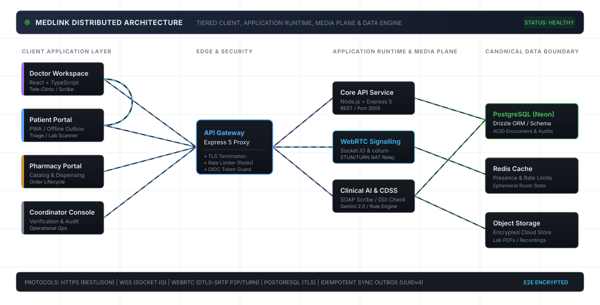
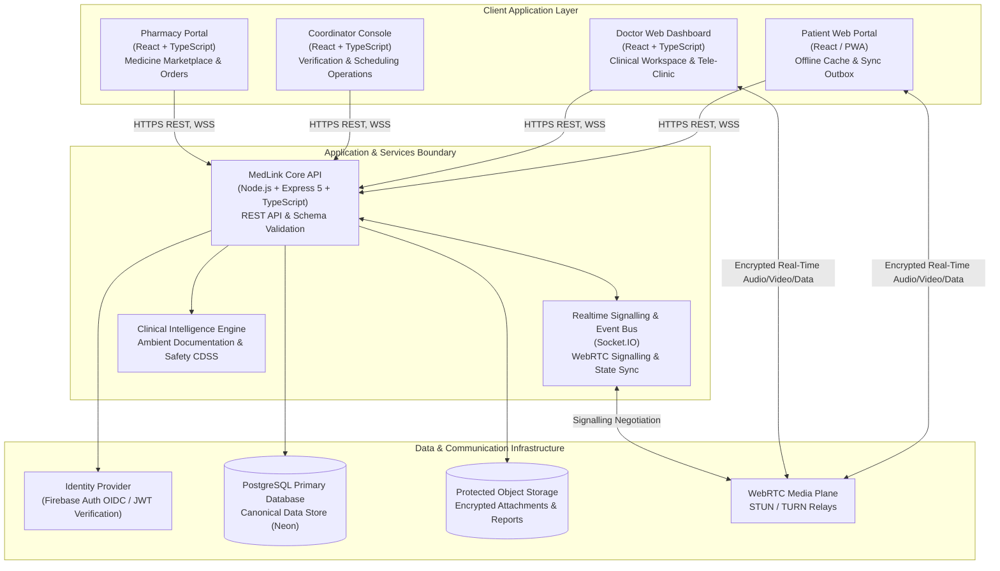
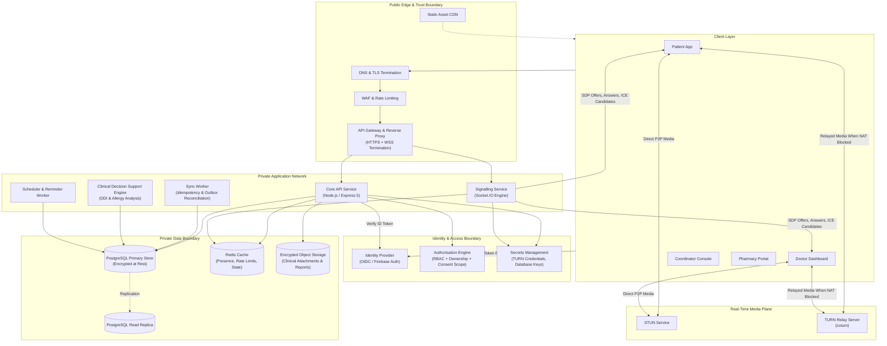
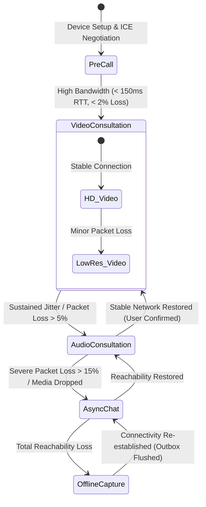
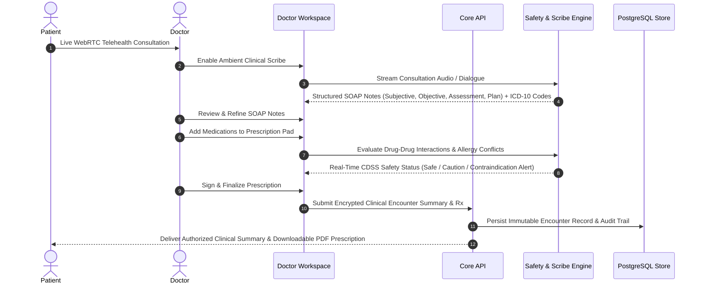
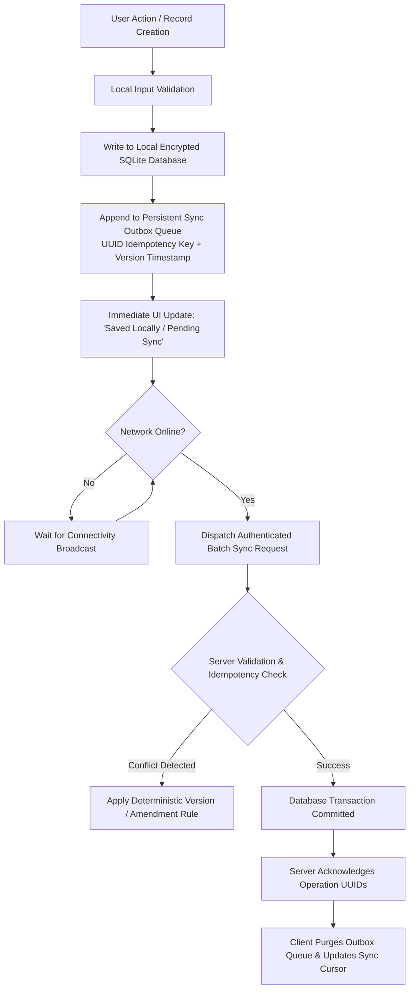

# MedLink

> **An adaptive, offline-first enterprise telemedicine and clinical intelligence platform for reliable consultations in low-connectivity and rural environments.**

MedLink connects patients with verified medical practitioners through a resilient, multi-portal architecture. Designed around a foundational principle: network instability or total connection loss must never disrupt clinical care continuity or compromise patient consultation data.

The platform governs the entire digital health encounter lifecycle: verified practitioner discovery, explainable specialty routing, appointment scheduling, WebRTC video/audio consultation with local composite recording, real-time clinical decision support (CDSS), ambient clinical note documentation, offline-first data capture, secure outbox synchronization, e-prescriptions, and operational follow-up.

---

<div align="center">
  
</div>

---

## Repository Workspace Structure

```text
medlink/
├── apps/
│   ├── patient-web/         React + TypeScript + PWA Patient Telehealth Portal
│   ├── doctor-web/          React + TypeScript Clinical Workspace & Tele-Clinic
│   ├── coordinator-web/     React + TypeScript Verification & Administration Console
│   ├── pharmacy-web/        React + TypeScript Pharmacy & Medicine Marketplace
│   └── landing-web/         React + TypeScript Public Landing & Architecture Gateway
├── services/
│   └── api/                 Node.js + Express 5 + TypeScript Backend Service
├── infra/                   Docker, TURN, and infrastructure deployment files
└── docs/                    Architecture decision records (ADRs) & system specifications
```

---

## 1. Product Architecture

MedLink operates as a unified, multi-application distributed system. Every portal interfaces with a centralized, canonical PostgreSQL data store, common authorization model, and real-time encounter lifecycle.



### Application Technical Responsibilities

| Application / Service | Technical Responsibility |
|---|---|
| **Patient Web Portal** | Responsive appointment booking, local offline outbox, diagnostic lab report visualization, real-time triage, WebRTC video/audio/chat controls, prescription history, and pharmacy ordering. |
| **Doctor Web Dashboard** | Operational appointment queue, availability slot management, authorized EHR review, WebRTC consultation room with composite recording and whiteboard, ambient clinical note drafting, CDSS safety-checked e-prescriptions. |
| **Coordinator Console** | Doctor and pharmacist profile verification, availability administration, appointment operations, reminder task queue, booking exceptions, and audit visibility. |
| **Pharmacy Web Portal** | Pharmacist onboarding, inventory catalog management, prescription-based dispensing, and order fulfillment tracking. |
| **Core API Service** | Token verification, role-based access control (RBAC), consent enforcement, request validation, transaction-safe booking, sync processing, WebRTC signaling, and audit logging. |
| **PostgreSQL Canonical Store** | Single source of truth for users, credentials, appointments, encounters, records, tasks, verification decisions, and audit metadata. |
| **WebRTC Media Plane** | Low-latency audio/video media transport, STUN/TURN NAT traversal, screen share streams, and collaborative data channels. |

---

## 2. Technical Reference Production Architecture

The diagram below represents the production-target deployment topology incorporating network zones, edge security, private application runtimes, and isolated data tiers.



---

## 3. Adaptive Consultation & Network Degradation Engine

The consultation engine continuously monitors connection reachability, WebRTC round-trip time (RTT), packet loss, jitter, and bandwidth availability. The system dynamically negotiates communication modes to maintain consultation continuity without loss of encounter context.



### Network Adaptation Policy Matrix

| Transition | Trigger Condition | System Behavior |
|---|---|---|
| **Video → Audio** | Sustained packet loss > 5%, RTT > 300ms, or video bitrate failure | Drops video tracks, renegotiates audio-only profile, and notifies both participants with a plain-language banner. |
| **Audio → Async Chat** | Media connection timeout or recurring disconnects | Preserves encounter context, transitions UI to encrypted real-time chat, and supports text/image exchange. |
| **Chat → Offline** | Total reachability failure after exponential backoff retries | Stores messages and clinical notes in local encrypted SQLite outbox with pending-sync status. |
| **Offline → Online** | Network reachability detected | Authenticates connection, replays outbox queue with idempotency keys, and pulls server updates. |
| **Audio → Video** | Sustained network stability for > 15 seconds | Displays non-intrusive prompt allowing participants to restore video stream without sudden bandwidth spikes. |

---

## 4. Clinical Encounter, Ambient Documentation & CDSS Lifecycle

MedLink separates raw consultation dialogue, clinical notes, decision support checks, and issued prescriptions into discrete, audited phases.



---

## 5. Offline-First Synchronization Protocol

The patient client employs a local-first write pattern. Data mutations are committed locally inside an encrypted store before network dispatch is attempted.



---

## 6. Access Control & Domain Boundaries

MedLink strictly separates clinical care, platform operations, and pharmacy distribution. Every API request is verified at the controller level; interface visibility is never used as an authorization boundary.

| Domain Entity | Patient | Assigned Doctor | Clinic Coordinator | Pharmacist | Privacy & Governance Rule |
|---|---|---|---|---|---|
| **Appointment Operations** | View / Request | View / Manage | View / Manage | No Access | Coordinator views operational metadata only. |
| **Draft Clinical Notes** | No Access | Create / Edit (Pre-final) | No Access | No Access | Doctor working document; never exposed before finalization. |
| **Final Clinical Summary** | View / Download | Author / View | No Access | No Access | Immutable once finalized; corrections require an explicit amendment. |
| **Prescription Records** | View / Download | Author / Amend | No Access | View (If Assigned) | Pharmacist accesses only prescriptions directed to their dispensing queue. |
| **Diagnostic Lab Reports** | View / Upload | View (With Consent) | No Access | No Access | Access is time- and encounter-scoped under patient consent. |
| **Audit Logs** | No Access | No Access | View Operational Logs | No Access | Append-only audit events capturing actor ID, timestamp, and IP hash. |

---

## 7. DevSecOps, Continuous Delivery & Observability

```mermaid
flowchart LR
    DEV[Developer Workstation] -->|Git Push| GH[GitHub Repository]
    GH -->|Trigger Webhook| CI[CI Pipeline<br/>Lint, Typecheck, Test Suite]
    CI -->|Quality Gate Passed| BUILD[Build Artifacts<br/>Vite Production Bundles + Docker Images]
    BUILD --> REG[Container & Package Registry]
    REG --> CD[Deployment Pipeline<br/>Staging → Verification → Production]
    CD --> RUNTIME[Production Runtime Network]
    RUNTIME --> OBS[Observability Stack<br/>Pino Structured Logging + Metrics]
    OBS --> AUDIT[Security Audit & Compliance Review]
```



### Security & Release Governance Standards
- **Zero Raw Credentials**: No storage of raw card numbers, CVVs, banking credentials, or payment secrets.
- **DTLS-SRTP Encryption**: Direct peer-to-peer encryption for audio, video, and data channels.
- **Immutable Clinical Audit**: All prescription authorizations, doctor verifications, and diagnostic record views generate auditable event records.
- **Automated Verification**: Release pipelines enforce static type safety, route schema validation, and test suite execution prior to deployment.

---

## 📜 License

This project is licensed under the [MIT License](LICENSE).
