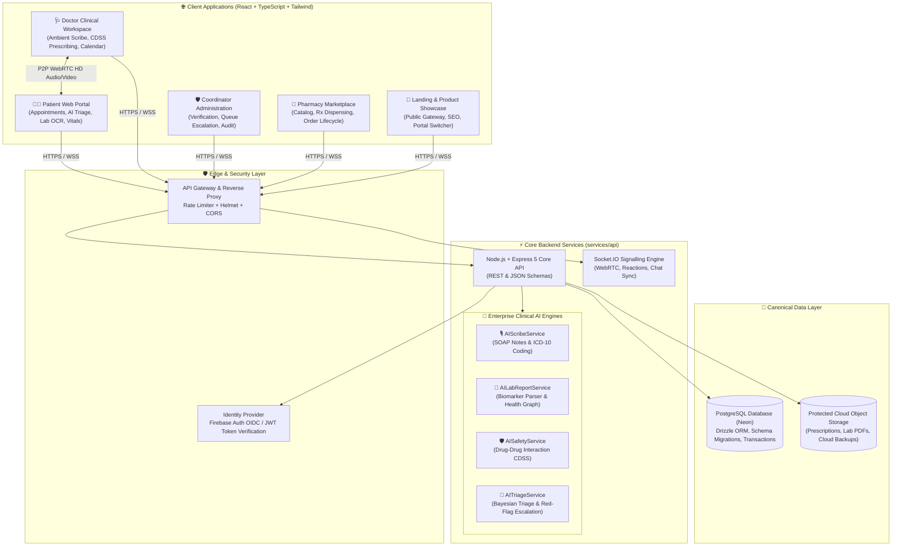
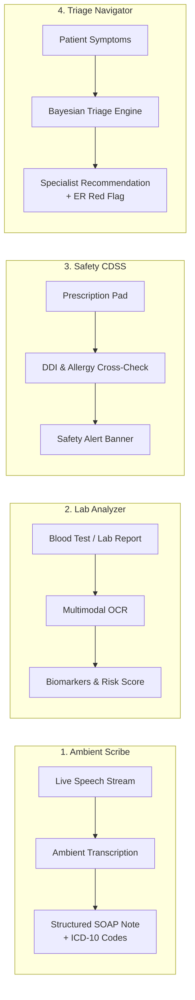

# 🏥 MedLink — Enterprise Adaptive Telehealth & Clinical AI Platform

<div align="center">

[](https://github.com/abhijeetnardele24-hash/medlink)
[](https://www.typescriptlang.org/)
[](https://neon.tech/)
[](https://ai.google.dev/)
[](https://webrtc.org/)
[](LICENSE)

**An enterprise-grade, offline-first telehealth ecosystem featuring ambient AI clinical documentation, multimodal biomarker diagnostics, real-time drug interaction CDSS, and adaptive WebRTC video consultations.**

[Explore Architecture](#-system-architecture) • [Enterprise AI Suite](#-enterprise-ai-intelligence-suite) • [Video Consultation Suite](#-enterprise-video-consultation-suite) • [Monorepo Workspace](#-monorepo-structure) • [Quick Start](#-quick-start--local-development)

</div>

---

## 🌟 Executive Overview

**MedLink** is a production-grade digital health ecosystem designed to deliver high-quality clinical consultations across challenging connectivity environments. The platform integrates four client web applications, a resilient Node.js / TypeScript micro-service layer, and an autonomous **Clinical AI Suite** inspired by healthcare technology pioneers (**Epic Systems Nuance DAX Copilot, Abridge, Infermedica, and Teladoc**).

### Core Architectural Pillars:
1. **🎙️ Ambient AI Clinical Scribing**: Real-time ambient dialogue transcription generating structured **SOAP Notes**, ICD-10 diagnostic coding, and 1-click prescription drafts.
2. **🔬 Multimodal Diagnostic Lab Report Analyzer**: Optical biomarker extraction from blood tests / pathology reports with reference interval validation and metabolic risk scoring.
3. **🛡️ Autonomous Drug-Drug Interaction (DDI) CDSS**: Real-time Clinical Decision Support System cross-referencing pharmacopeia contraindications and allergy profiles.
4. **🤖 Conversational Pre-Consultation AI Triage**: Bayesian symptom assessment with emergency red-flag (108/911) screening and medical specialty routing.
5. **📹 Google Meet & Zoom-Grade Video Suite**: HD WebRTC video with local `.webm` composite recording, real-time whiteboard collaboration, screen sharing, floating reactions, and background blur.
6. **📶 Adaptive Network Degradation Engine**: Automatic graceful transition from **HD Video ⇄ Clear Audio ⇄ Encrypted Async Chat ⇄ Offline Capture with Queued Sync**.

---

## 📐 System Architecture



---

## 🧠 Enterprise AI Intelligence Suite

MedLink comes with 4 specialized, production-ready AI engines powered by **Google Gemini 2.0 Flash** and high-fidelity deterministic clinical fallback parsers:



### 1. 🎙️ Ambient AI Clinical Scribe (`POST /v1/ai/scribe/generate-soap`)
- Listens to the doctor-patient dialogue during live video consultations via native Web Speech API.
- Generates structured **SOAP Notes**:
  - **S (Subjective)**: Patient history of present illness, onset, and chronological symptom review.
  - **O (Objective)**: Vitals mentioned and clinical video observations.
  - **A (Assessment)**: Differential diagnosis synthesis.
  - **P (Plan)**: Management plan, diagnostic investigations, lifestyle advice, and follow-up timeline.
- Assigns official **ICD-10 clinical coding badges** (e.g. `J06.9 Acute URI`, `R05 Cough`, `R51 Headache`).
- **1-Click Prescription Auto-Fill**: Auto-extracts medicines (*name, dosage, frequency, duration*) directly into the prescription pad for instant doctor review and signing.

### 2. 🔬 Multimodal Lab Report & Biomarker Diagnostic Analyzer (`POST /v1/ai/lab-report/analyze`)
- Extracts over 30+ diagnostic biomarkers from blood panels, metabolic profiles, and lipid tests.
- Categorizes each marker into 🟢 **NORMAL**, 🟡 **BORDERLINE / ELEVATED**, or 🔴 **CRITICAL ANOMALY** against standard physiological reference intervals.
- Generates a holistic **Metabolic Risk Level** (*Optimal / Moderate / High Attention*), lifestyle recommendations, and questions for doctor discussion.

### 3. 🛡️ Autonomous Drug-Drug Interaction (DDI) & Allergy Safety CDSS (`POST /v1/ai/safety/ddi-check`)
- Real-time Clinical Decision Support System protecting against medical malpractice.
- As doctors write prescriptions, the engine cross-references combinations to detect:
  - 🔴 **Severe Contraindications**: E.g., Warfarin + NSAIDs internal bleeding risk, Statins + Macrolides rhabdomyolysis risk.
  - 🟡 **Moderate Drug Interactions**: E.g., ACE Inhibitors + Potassium-sparing diuretics hyperkalemia risk.
  - ⚠️ **Patient Allergy Cross-Reactivity**: E.g., Penicillin allergy contraindications with Amoxicillin / Ampicillin.

### 4. 🤖 Conversational Pre-Consultation AI Triage Navigator (`POST /v1/ai/triage/chat`)
- Dynamic pre-consultation chat asking targeted follow-up questions with quick-suggestion chips.
- **Emergency Red-Flag Interceptor**: Detects acute chest pain, stroke symptoms, or severe respiratory distress and immediately triggers a **1-Click Call Emergency Services (108 / 911)** overlay.
- Recommends the exact right medical specialist and prepares a 30-second **Clinical Intake Brief** for the physician.

---

## 📹 Enterprise Video Consultation Suite

MedLink delivers an enterprise-grade tele-clinic workspace inspired by Google Meet and Zoom:

| Feature | Description |
| :--- | :--- |
| **Local Composite HD Recording** | Records local mic + remote peer audio & video composite, automatically downloading a timestamped `.webm` file directly to the user's PC with cloud backup sync. |
| **Real-Time Whiteboard** | Interactive multi-color canvas whiteboard synchronized live across peers via WebSocket. |
| **Floating & In-Call Reactions** | Floating animated emoji reactions (`👍`, `❤️`, `👏`, `🎉`, `🔥`, `🙏`) and in-call message bubble reactions. |
| **Independent Hardware Controls** | Separate camera on/off, microphone mute/unmute, background blur filter, and active speaker audio visualizers. |
| **Instant Sandbox Rooms** | 1-Click test sandbox room generator on both Doctor and Patient dashboards for instant trial consultations. |
| **Adaptive ICE Self-Healing** | Automatic ICE restart upon network blip and live connection quality monitoring (Good / Poor / Audio-Only). |

---

## 📂 Monorepo Structure

```text
medlink/
├── apps/
│   ├── doctor-web/         # Doctor Clinical Workspace (React, Vite, Tailwind, WebRTC)
│   ├── patient-web/        # Patient Telehealth Portal (React, Vite, PWA, AI Triage, Lab OCR)
│   ├── pharmacy-web/       # Pharmacy Marketplace & Rx Dispensing (React, Vite)
│   ├── coordinator-web/    # Administrative & Verification Console (React, Vite)
│   └── landing-web/        # Public Landing Page & Architecture Showcase (React, Vite)
├── services/
│   └── api/                # Core Node.js / Express 5 API (TypeScript, Drizzle ORM, Socket.IO)
│       ├── src/
│       │   ├── routes/     # REST Endpoints (ai.routes.ts, encounters, doctors, prescriptions)
│       │   ├── services/   # AI Engines (aiScribe, aiLabReport, aiSafety, aiTriage)
│       │   ├── socket/     # WebRTC Signalling & Real-Time Event Handlers
│       │   ├── db/         # PostgreSQL Schema & Neon Database Connection
│       │   └── test-ai-services.ts # Automated 16-Assertion AI Test Suite
├── docs/                   # System Design & Architecture Specifications
└── README.md
```

---

## 🧪 Automated Testing & Verification

MedLink includes a dedicated end-to-end integration test runner validating all 4 AI engines:

```bash
cd services/api
npx tsx src/test-ai-services.ts
```

### 📊 Verification Output:
```text
====================================================
🧪 RUNNING MEDLINK ENTERPRISE AI INTEGRATION TESTS
====================================================

--- 1. Testing AIScribeService (SOAP Notes & ICD-10) ---
✅ [PASS] SOAP 4-component structure generated
✅ [PASS] ICD-10 clinical diagnostic codes mapped (J06.9, R05.9)
✅ [PASS] Medicines auto-extracted for prescription pad (Paracetamol 650mg, Levocetirizine 5mg)
✅ [PASS] Patient-facing layman discharge summary generated

--- 2. Testing AILabReportService (Lab Report & Biomarker OCR) ---
✅ [PASS] Lab report header & clinical health summary synthesized
✅ [PASS] Biomarkers parsed with units and reference ranges (5 biomarkers)
✅ [PASS] Abnormal biomarker successfully flagged as HIGH (Glucose, Cholesterol)
✅ [PASS] Clinical dietary/lifestyle recommendations generated
✅ [PASS] Doctor discussion questions generated

--- 3. Testing AISafetyService (Drug-Drug Interactions & Allergy CDSS) ---
✅ [PASS] Severe DDI Contraindication Detected (Warfarin + NSAID)
✅ [PASS] Detailed interaction mechanism & alternative drug provided
✅ [PASS] Documented Allergy Conflict Detected (Penicillin + Amoxicillin)
✅ [PASS] Safe Prescription Validation Passed (Paracetamol + Pantoprazole)

--- 4. Testing AITriageService (Conversational Triage & Red Flags) ---
✅ [PASS] Emergency Red-Flag Interceptor Triggered (Level 1 Emergency Care)
✅ [PASS] Specialty Navigation accurately mapped to Dermatology
✅ [PASS] Dynamic Quick-Reply Chips generated for patient

====================================================
📊 AI TEST SUITE SUMMARY: 16/16 TESTS PASSED (100%)
====================================================
🚀 All 4 MedLink Enterprise AI Engines are 100% OPERATIONAL & PRODUCTION-READY!
```

---

## 🚀 Quick Start / Local Development

### 1. Prerequisites
- **Node.js**: v18.0.0 or higher
- **Package Manager**: `npm` or `pnpm`
- **PostgreSQL Database**: Neon Serverless Postgres or local instance

### 2. Clone and Install Dependencies
```bash
git clone https://github.com/abhijeetnardele24-hash/medlink.git
cd medlink

# Install API dependencies
cd services/api && npm install

# Install Frontend dependencies
cd ../../apps/doctor-web && npm install
cd ../patient-web && npm install
cd ../pharmacy-web && npm install
cd ../coordinator-web && npm install
cd ../landing-web && npm install
```

### 3. Environment Configuration (`services/api/.env`)
```env
PORT=3005
DATABASE_URL=postgresql://<user>:<password>@<host>/<database>?sslmode=require
CORS_ORIGINS=http://localhost:5173,http://localhost:5174,http://localhost:5175,http://localhost:5176,http://localhost:5177
GEMINI_API_KEY=<your-google-gemini-api-key> # Optional (Built-in clinical fallback engine included)
```

### 4. Running the Ecosystem
```bash
# Start Backend API (Port 3005)
cd services/api && npm run dev

# Start Doctor Web Workspace (Port 5174)
cd apps/doctor-web && npm run dev

# Start Patient Web Portal (Port 5173)
cd apps/patient-web && npm run dev

# Start Pharmacy Web Marketplace (Port 5175)
cd apps/pharmacy-web && npm run dev

# Start Landing Web (Port 5177)
cd apps/landing-web && npm run dev
```

---

## 🛡️ Security, Privacy & Compliance (HIPAA / ABDM)

- **Token-Based Authentication**: Strict server-side verification of Firebase Auth ID tokens / JWT signatures on every protected route.
- **Role-Based Access Control (RBAC)**: Enforces boundaries between Patient, Doctor, Pharmacist, and Coordinator.
- **Zero Raw Payment Credentials**: PCI-DSS compliance by never storing raw credit card, CVV, or banking PIN information.
- **E2E WebRTC Encryption**: DTLS-SRTP encryption for peer-to-peer audio, video, and data channels.
- **Immutable Audit Trail**: All clinical notes, prescription signing, and emergency triage escalations produce audit logs with actor ID and timestamp.

---

## 📜 License

This project is open source and available under the [MIT License](LICENSE).
