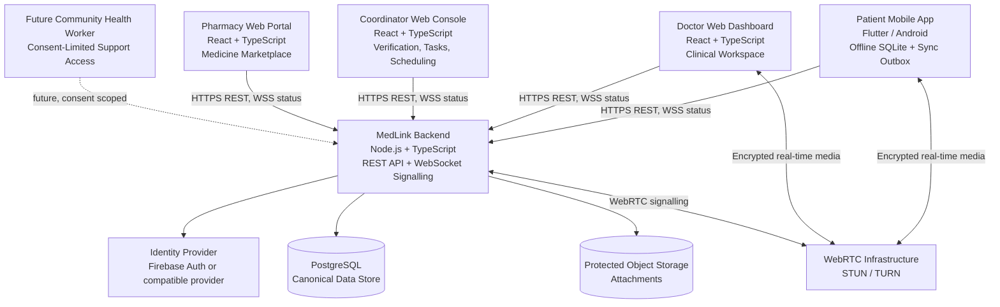
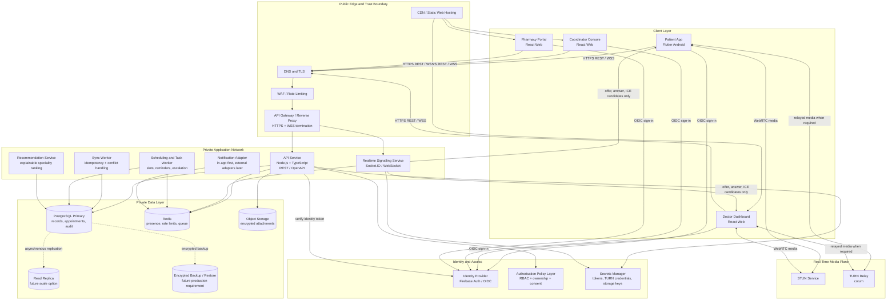
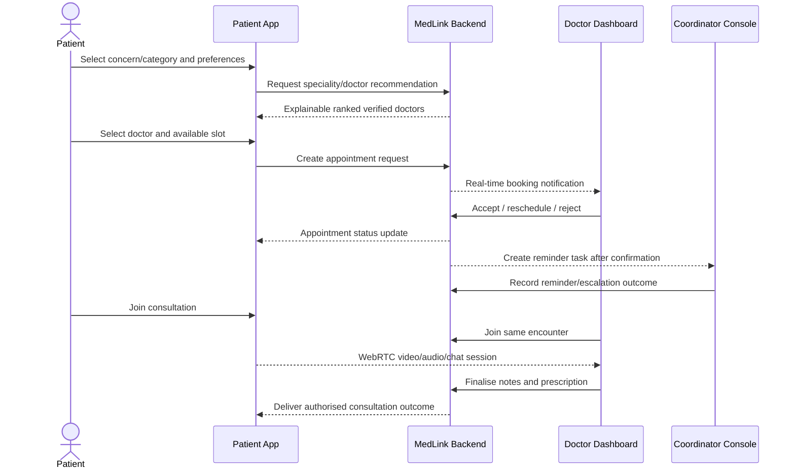
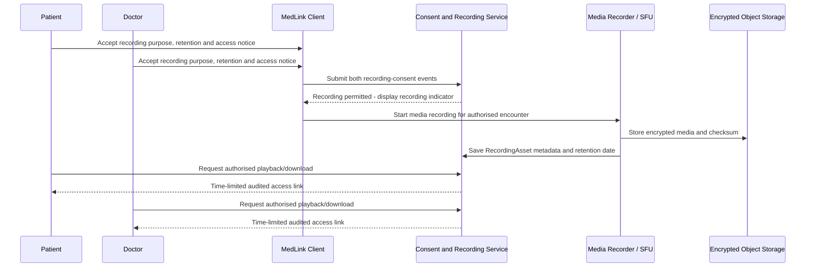

# MedLink

> **An adaptive, offline-first telemedicine platform for reliable consultations in low-connectivity and rural environments.**

MedLink connects patients on an Android mobile app with doctors working from a web dashboard. It is designed around a simple principle: a weak or lost network connection must not end access to care or lose consultation information.

The platform manages the complete telemedicine lifecycle: verified doctor discovery, speciality-based recommendation, appointment coordination, live consultation, network-aware communication switching, offline data capture, secure synchronisation, prescriptions and operational follow-up.

> **Academic scope:** MedLink is an educational prototype built with synthetic/demo data. It is not a certified medical device, does not make diagnoses, does not process real payments, and must not be used for emergencies or real clinical deployment without legal, clinical, security and operational approval.

## Repository workspace

```text
medlink/
├── apps/
│   ├── patient-mobile/      Flutter app
│   ├── doctor-web/          React dashboard
│   ├── coordinator-web/     React verification console
│   └── pharmacy-web/        React pharmacy & medicine marketplace
├── services/
│   └── api/                 Node.js + TypeScript backend
├── infra/                   Docker and infrastructure files
└── docs/                    Architecture decisions
```

## Project objective

Conventional telemedicine applications are commonly designed around stable video connectivity. In rural or remote areas, unstable mobile data can interrupt a consultation, prevent appointment updates and lose information entered during the call.

MedLink uses an adaptive consultation model:

```text
Stable network                Weak network                 No network
──────────────                ────────────                 ──────────
Video consultation  ───────→ Audio consultation ───────→ Secure async chat
        ↑                                                          │
        └──────────── restored and stable connection ─────────────┘
                                                                   │
                                                           Offline capture
                                                                   │
                                                    queued sync on reconnection
```

The system preserves the same appointment and encounter context across every communication mode. Data is written locally first on the patient device, queued safely, and synchronised with the shared system once connectivity is restored.

## Product architecture

MedLink is a connected multi-application system. It is not separate patient and doctor projects: every application uses one shared API, canonical data store, authorisation model and encounter lifecycle.



### Application responsibilities

| Application/service | Technical responsibility |
|---|---|
| Patient mobile app | Mobile-first appointment flow, local encrypted records, offline outbox, network quality measurement, video/audio/chat controls, prescription/history viewing. |
| Doctor web dashboard | Appointment queue, availability, authorised patient record review, WebRTC consultation workspace, notes, prescription finalisation and encounter status. |
| Coordinator console | Doctor profile verification, speciality/availability administration, appointment operations, reminder task queue, booking exceptions and audit visibility. |
| Pharmacy web portal | Search/browse medicines, cart and checkout, integration with digital prescriptions for rx-required items, order status tracking. |
| Node.js backend | Authentication token verification, role-based access control, consent enforcement, API validation, atomic booking, sync processing, recommendation logic, signalling and audit generation. |
| PostgreSQL | Canonical shared data for users, roles, doctors, appointments, encounters, records, tasks, verification decisions and audit metadata. |
| SQLite on patient device | Offline replica/cache and durable outbox; never the final shared source of truth. |
| WebRTC + STUN/TURN | Low-latency audio/video media transport and connectivity traversal. |
| Object storage | Access-controlled attachments and metadata/checksums; attachments are not stored as database blobs. |

### Technical reference architecture — production target

The diagram below is the senior-engineering reference design for a scalable deployment. The academic demo can run the same logical services locally with Docker; cloud networking, managed services, replicas and monitoring are future production hardening layers.



#### Network and security boundaries

| Zone | Components | Engineering rule |
|---|---|---|
| Public edge | DNS, TLS termination, WAF, static-web delivery, gateway | Expose only HTTPS/WSS and required TURN ports; rate-limit and reject malformed traffic before it reaches services. |
| Identity boundary | OIDC/Firebase identity provider and backend token verification | Clients authenticate with the identity provider; APIs trust only validated, unexpired tokens and never client-provided roles. |
| Private runtime | API, signalling, sync, scheduling, recommendation and notification services | Services are not directly internet-facing. They receive traffic only through the gateway and use least-privilege service credentials. |
| Data boundary | PostgreSQL, Redis, object storage, backups | No public database access. Encrypt in transit/at rest, use private network rules, versioned migrations and tested restore processes. |
| Media plane | STUN/TURN | WebRTC media is separate from APIs. TURN credentials are short-lived and media telemetry excludes clinical content. |

### DevSecOps, delivery and observability architecture

```mermaid
flowchart LR
    DEV[Developer Workstation]
    GH[GitHub Repository<br/>main branch + pull requests]
    CI[CI Pipeline<br/>lint, unit test, API contract test,<br/>dependency scan, secret scan]
    BUILD[Build and Package<br/>Flutter APK, web bundle,<br/>versioned backend container]
    REG[Artifact / Container Registry]
    CD[Deployment Pipeline<br/>staging → approval → production]
    IAC[Infrastructure as Code<br/>network, runtime, data policies]
    RUN[Runtime Services]
    OBS[Observability Stack<br/>metrics, structured logs, traces,<br/>uptime checks, alert rules]
    SEC[Security Operations<br/>audit review, vulnerability triage,<br/>backup/restore verification]

    DEV -->|commit / pull request| GH
    GH --> CI
    CI -->|quality gate passed| BUILD
    BUILD --> REG
    IAC --> CD
    REG --> CD
    CD --> RUN
    RUN -->|health, metrics, logs, traces| OBS
    OBS -->|alerts and dashboards| SEC
    RUN -->|security and access events| SEC
```



The minimum release quality gate is: formatting/lint checks, unit tests, API validation tests, role-access tests, offline-sync tests, dependency/secret scan, and a manually verified degraded-network consultation scenario. Production deployment should additionally require database migration review, backup/restore evidence, monitored error budgets and a rollback plan.

## Users, roles and access model

MedLink separates clinical care from platform operations. Every request is authorised by the backend; hiding a screen option is never treated as access control.

| Role | Main capabilities | Privacy boundary |
|---|---|---|
| Patient | Maintains own profile, searches doctors, requests appointments, gives consent, joins consultations, reads own authorised records and prescriptions. | Can access only their own data and published doctor information. |
| Doctor | Manages availability, accepts/reschedules appointments, consults assigned patients, writes notes and prescriptions. | Can access only patients with an authorised care/appointment relationship. |
| Pharmacist | Manages medicine catalog listings, reviews verified stock, and processes digital prescriptions or direct orders. | Can access only medicine catalog and patient orders directed to their pharmacy. |
| Clinic Coordinator/Admin | Verifies doctor profiles, manages operational scheduling, sends/escalates reminders and resolves non-clinical booking issues. | Does not view clinical notes, private chat, attachments, diagnoses or prescriptions by default. |
| Recommendation engine | Ranks specialities/doctors from structured preferences and returns an explanation. | Never diagnoses, prescribes, makes the final choice or performs autonomous booking. |
| Community Health Worker (future) | Helps a consented patient access the platform at a health centre or supports device use. | Receives only limited, time-bound, consent-scoped access. |

## Core workflow



### Appointment lifecycle

```text
DRAFT / QUEUED_OFFLINE
          ↓
REQUESTED → PENDING_DOCTOR → CONFIRMED → IN_PROGRESS → COMPLETED
                 │               │              │
                 ├→ RESCHEDULED ─┘              └→ FOLLOW_UP_NEEDED
                 ├→ REJECTED
                 ├→ CANCELLED
                 └→ MISSED
```

The backend validates state transitions and record versions inside a database transaction. This prevents stale updates and prevents multiple patients from successfully reserving the same doctor slot.

## Doctor discovery, verification and recommendation

Patients can browse a searchable doctor directory using specialisation, language, availability, consultation modes, clinic/facility and verified status.

Doctor onboarding follows a controlled lifecycle:

```text
DRAFT → PENDING_VERIFICATION → VERIFIED → SUSPENDED
                 │                  │
                 ├→ NEEDS_CORRECTION┘
                 └→ REJECTED
```

Only verified profiles are visible for new appointments. The coordinator’s verification decision captures reviewer, timestamp, decision, reason code and audit event. In the educational demo, doctor identities and documents are synthetic and must be labelled **Demo verified by MedLink**. The project must not claim external government or medical-licence verification unless an official integration has actually been implemented.

The recommendation capability is deliberately explainable:

```text
Concern category + language + preferred time + consultation mode
                              ↓
                 Suggested speciality
                              ↓
        Verified doctors ranked by transparent scoring
                              ↓
            Explanation presented to the patient
```

An initial score combines speciality match, availability, language, consultation-mode support and low-bandwidth suitability. The patient can always search manually and makes the final doctor selection. This is a care-navigation feature, not an AI diagnosis system.

## Adaptive consultation engine

The consultation engine continuously evaluates connection reachability, WebRTC round-trip time, jitter, packet loss, bitrate and reconnection events.

```text
PRE_CALL → VIDEO ⇄ AUDIO ⇄ ASYNC_CHAT ⇄ OFFLINE
                 │          │              │
                 └──────────┴──────────────┘
                  use hysteresis/cooldown to avoid flapping
```

Initial switching policy:

| Transition | Example sustained condition | System behaviour |
|---|---|---|
| Video → audio | High packet loss, high jitter, high RTT or insufficient video bitrate | Inform both participants and renegotiate without video where possible. |
| Audio → asynchronous chat | Media repeatedly disconnects or audio is unusable | Preserve the encounter; enable encrypted text/image messaging. |
| Chat → offline | Reachability checks fail after retries | Save all actions locally, display pending-sync state and retry safely later. |
| Audio → video | Network remains stably healthy for a recovery period | Ask users before restoring video to protect data usage and avoid surprise switching. |

The doctor and patient see the current mode and a plain-language reason for any change. Users may manually choose a lower-bandwidth mode whenever connectivity allows.

## Offline-first synchronisation

The patient app writes data locally before attempting a network request.

```text
User action
  → local validation
  → encrypted SQLite transaction
  → persistent sync-outbox operation with UUID idempotency key
  → immediate UI update: “Saved on this device / Pending sync”
  → authenticated server push when online
  → server acknowledgement
  → pull server changes using sync cursor
```

Each queued operation has an `operation_id`, record version, retry state and error code. The backend handles repeat delivery idempotently, so an interrupted retry cannot create duplicate messages, appointments or records. Clinical documents use immutable version/amendment behaviour rather than silent last-write-wins overwrites.

## Domain model

| Domain entity | Purpose |
|---|---|
| User, Patient, Doctor, Pharmacist | Identity and role-specific profile data. |
| DoctorVerification, PharmacistVerification, AvailabilitySlot | Verification state and publicly bookable time slots. |
| Medicine, DoctorMedicineRecommendation | Centralized medicine catalog, listings, and doctor-specific trusted recommendations. |
| Appointment, Encounter | Scheduled care relationship and actual consultation lifecycle. |
| ConsultationNote, ConsultationSummary | Doctor-authored draft/final clinical documentation and a patient-visible final summary. |
| Prescription, Attachment | Issued prescription versions and authorised clinical documents/reports. |
| PatientHealthDiaryEntry | Patient-owned journal entry; never shared with a doctor unless the patient explicitly chooses to share it. |
| ConsentGrant | Purpose-, scope- and time-bound data-sharing permission. |
| ReminderTask | Coordinator-owned operational follow-up task and outcome. |
| Invoice, PaymentRecord (demo only) | Price snapshot and `FREE_DEMO`, `PENDING`, `SUCCESS`, `FAILED` or `REFUNDED` status; no real payment information. |
| RecordingAsset (future) | Consent-bound encrypted recording metadata, checksum, retention date and access-audit trail; media remains in protected object storage. |
| RecommendationEvent | Matching input/output/explanation version for transparency and evaluation. |
| SyncOperation, AuditEvent | Reliable synchronisation evidence and minimally necessary security/operational audit trail. |

## Clinical, financial and media records

MedLink treats clinical records, payment information and recorded media as separate protected domains. The system stores only the minimum data required for each purpose, applies purpose-specific consent, and records access to sensitive artefacts.

### Visibility and ownership model

| Record | Patient | Assigned doctor | Coordinator/admin | Rules |
|---|---:|---:|---:|---|
| Appointment and slot status | View | View/manage | View/manage | Coordinator sees operational status only. |
| Doctor draft consultation note | No | Create/view/edit until finalised | No | Clinical working document; never exposed by default. |
| Final consultation summary | View/download | Create/finalise/view | No | Immutable/versioned after finalisation; amendment creates a new version. |
| Prescription | View/download | Issue/amend/view | No | Signed/issued version is immutable; correction is an amendment, not silent edit. |
| Patient report or image | View/manage consent | View only with active consent | No | Attachment access is time- and encounter-scoped. |
| Patient health diary | View/create/edit | Only if patient shares it | No | Patient-owned by default; sharing can be revoked for future access. |
| Invoice and receipt | View/download | View consultation fee/settlement state | View/manage payment status | No card, UPI, bank or gateway secrets stored by MedLink. |
| Consultation recording | View only with explicit recording consent | View only with explicit recording consent | No by default | Disabled by default; access is audited and expires under retention policy. |

### Consultation notes, prescriptions and patient diary

```text
Doctor creates consultation note as DRAFT
        ↓
Doctor reviews and FINALISES the clinical summary
        ↓
Patient receives authorised final summary and prescription
        ↓
If correction is required: create AMENDMENT linked to original version

Patient health diary remains private
        ↓
Patient selects “Share with doctor for this encounter”
        ↓
Doctor receives time-bound, consent-scoped access
```

This separation prevents accidental disclosure of unfinished clinical notes while giving the patient access to the agreed consultation outcome. All finalisation, amendment, access, export and consent-revocation actions create audit events.

### Price, invoice, receipt and payment status

MedLink supports the booking and accounting workflow without handling real payment in the educational prototype.

```text
Doctor publishes consultation fee
        ↓
Patient selects a slot
        ↓
System creates immutable fee snapshot in Invoice
        ↓
Demo PaymentRecord transitions:
FREE_DEMO → PENDING → SUCCESS / FAILED / REFUNDED
        ↓
After doctor acceptance, patient receives booking confirmation and demo receipt
```

`Invoice` stores the displayed consultation fee, optional discount, total, currency and status at booking time. `PaymentRecord` stores only a demo status and non-sensitive reference. MedLink must never store payment-card number, CVV, UPI PIN, bank account information or payment-gateway secret. A production payment-provider integration is future scope and requires refund, dispute, reconciliation and legal/compliance workflows.

### Consent-first consultation recording — future phase

Recording is not part of the first MVP. It is a high-sensitivity feature that requires a dedicated media pipeline, clear consent, storage budgeting, retention policy, secure deletion and access auditing. The core MVP stores the encounter timeline, messages, notes, prescription, reports, invoice/receipt and network-mode history instead.

If recording is enabled in a later phase, it follows this explicit workflow:



The architecture requirement is important: a normal peer-to-peer WebRTC call does not automatically create a server-side recording. Production recording needs a separate media recorder or SFU/recording service. It must write encrypted media to protected object storage rather than through the main Node.js API process.

```text
Patient / Doctor WebRTC media
             ↓
Media recorder or SFU recording worker
             ↓
Encrypt + checksum + malware/media validation
             ↓
Protected object storage
             ↓
RecordingAsset metadata in PostgreSQL
  - encounter ID, both consent IDs, storage key, checksum
  - started/ended timestamps, retention-until, deletion status
  - access audit events, no recording content in application logs
             ↓
RBAC + consent check → short-lived signed playback/download URL
```

Mandatory recording controls are: recording disabled by default, explicit consent from both patient and doctor, always-visible recording indicator, start/stop audit events, encryption in transit and at rest, no coordinator access by default, retention date, secure deletion workflow, and an access log for every playback/download. In the free presentation demo, a short synthetic recording may be used only as an optional proof of concept; no real patient data or real consultation recording is permitted.

## Security and privacy architecture

- Firebase ID tokens, or a compatible identity-provider token, are verified server-side on every protected request.
- Backend role-based access control checks role, ownership, appointment/encounter relationship and consent scope.
- HTTPS/WSS protects API and real-time signalling traffic; protected TURN credentials are required for deployed relay usage.
- The patient local database is encrypted and its key is stored using platform secure storage.
- Attachments use protected object storage, content-type/size validation and integrity checksums.
- Health information is excluded from URLs, notification previews, analytics events, crash reports and broad operational logs.
- Sensitive actions—verification decision, record access, consent change, prescription finalisation and sync result—produce auditable events.
- The coordinator is intentionally restricted to operational metadata by default.

## Technology direction

| Layer | Selected technology direction |
|---|---|
| Patient application | Flutter, Android-first, Riverpod/Provider state management, encrypted SQLite, secure storage, WebRTC client. |
| Doctor/coordinator applications | React + TypeScript responsive web dashboard. |
| API and real-time services | Node.js + TypeScript, REST API, WebSocket/Socket.IO signalling, schema validation. |
| Data | PostgreSQL, migrations, foreign keys, version columns, transactions and audit tables. |
| Identity | Firebase Authentication free tier for the demo, with server-side token verification; a compatible self-hosted provider remains a future option. |
| Media | WebRTC with STUN/TURN; coturn is suitable for a controlled demonstration. |
| Storage | One protected provider only: Firebase Storage or S3-compatible storage; never both in the MVP. |
| Deployment model | Zero-cost local/Docker demonstration first; hosted free tiers are optional showcase environments, not production guarantees. |

## Demonstration boundary

The project is designed to demonstrate a complete, technically realistic workflow at zero monetary cost:

- Synthetic patients, doctors, consultation notes and verification documents only.
- No Aadhaar, real licence documents, real medical records or real consultation recordings.
- Simulated payment state only; no UPI, card, banking or real gateway credentials.
- Local/Docker-based service deployment and controlled Wi-Fi/hotspot testing are sufficient for the final demonstration.
- Network impairment tests deliberately demonstrate video-to-audio-to-chat/offline continuity and successful later synchronisation.

## Quality goals and evaluation

MedLink is successful when it can demonstrate all of the following:

1. A verified doctor is discoverable by speciality, language and availability.
2. A patient requests and receives a confirmed appointment from the Android app.
3. A coordinator can manage verification and reminders without viewing clinical content.
4. Patient and doctor complete the same WebRTC encounter through mobile and web interfaces.
5. The system degrades communication safely when network quality falls.
6. Offline appointment/message/record operations survive app restart and synchronise exactly once after reconnection.
7. Unauthorised users cannot access another patient’s data or an unassigned encounter.
8. Recommendation output is explainable, optional and never presented as a diagnosis.

Useful project metrics include mode-switch latency, consultation continuity rate, sync success rate, sync recovery time, duplicate-operation count, detected conflict count, unauthorised-access rejection rate and task completion rate for patient/doctor/coordinator workflows.

## Future scope

- Consent-based Community Health Worker access for rural health-centre support.
- ABDM/HPR/FHIR interoperability after official API, privacy and conformance work.
- AI-assisted free-text concern categorisation with explicit consent, local safety policy, independent validation and doctor oversight.
- Multilingual and voice-guided patient onboarding.
- Medication reminders, follow-up scheduling and chronic-care plans.
- Production payment-provider integration with refund, dispute and reconciliation workflows.
- Clinical quality dashboards, reliability monitoring and hardened multi-region deployment.
- Accessibility features for low literacy, disabilities and regional languages.

## Research and design record

The detailed research, rationale, system design, security considerations, sync protocol, algorithms, risks, test plan and references are maintained in [PROJECT_RESEARCH_AND_ANALYSIS.md](PROJECT_RESEARCH_AND_ANALYSIS.md).

Key reference directions include WHO digital-health and AI governance guidance, ABDM/HPR verification context, HL7 FHIR interoperability and WebRTC/TURN technical documentation. These sources inform the architecture but do not constitute an operational compliance certification.

## Contributors

- [@team-narcos](https://github.com/team-narcos)
